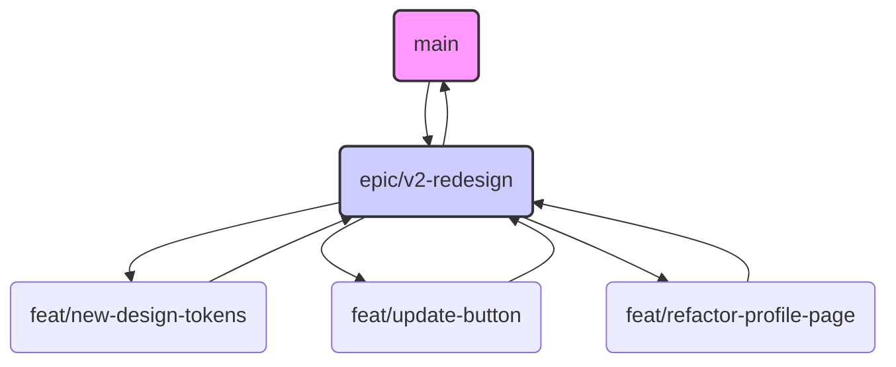

# V2 Redesign & Refactor Plan

This document outlines the strategy and steps for the V2 redesign of the Zipli application. We are following a structured approach to ensure the `main` branch remains stable while we work on significant changes to the UI, app logic, and potentially the backend.

## 1. Branching Strategy

All work for this redesign will be done on the `epic/v2-redesign` branch.

- **Epic Branch:** `epic/v2-redesign`
- **Feature Branches:** All new features or component updates (e.g., `feat/new-button-component`) should branch off from `epic/v2-redesign`.
- **Pull Requests:** Feature branches should be merged back into `epic/v2-redesign` via Pull Requests.
- **Completion:** Once the entire redesign is complete and tested on the epic branch, it will be merged into `main`.

## 2. Documentation Strategy

We will follow a "Living Documentation" approach.

- **High-Level Plan:** This document serves as the high-level plan.
- **Storybook:** As UI components are updated or created, their stories in Storybook must also be updated. Storybook will be our primary, interactive UI documentation.
- **Code Comments:** Complex logic, component props (`<ButtonProps>`), and API endpoints should be documented directly in the code using TSDoc/JSDoc.

## 3. Implementation Checklist

### Phase 1: Design System Foundation
- [ ] **Export New Tokens:** Export all design tokens (colors, typography, spacing, radii) from the new Figma file.
- [ ] **Update Token File:** Replace the contents of `tokens/figma.tokens.json` with the new export.
- [ ] **Process Tokens:** Run Style Dictionary (`npx style-dictionary build`) to generate `tokens/tokens.css` and `tokens/tailwind.colors.js`.
- [ ] **Update Tailwind Config:** Modify `tailwind.config.js` to reflect the new design system (colors, fonts, spacing, etc.), ideally by importing from the generated token files.
- [ ] **Update Global CSS:**
    - [ ] Update `src/app/globals.css` with new base styles.
    - [ ] Define the necessary shadcn/ui CSS variables (`--background`, `--primary`, `--card`, etc.) in `globals.css` based on the new tokens.
- [ ] **Update Fonts:** Update the `next/font` setup in `src/app/layout.tsx` if new fonts or weights are required.
- [ ] **Update Atomic Components:**
    - [ ] Refactor `src/components/ui/button.tsx` to match the new design system.
    - [ ] Refactor `src/components/ui/input.tsx`.
    - [ ] Refactor other core UI components (`card`, `dialog`, `select`, etc.).
    - [ ] Update Storybook stories for all modified components.

### Phase 2: Backend & Core Logic
- [ ] **Identify Schema Changes:** Determine if any database schema changes are needed for the new app logic.
- [ ] **Create Migrations:** If needed, create new Supabase migration files for schema changes.
- [ ] **Update API Endpoints:** Modify or create new API routes in `/app/api/` to support the new features.

### Phase 3: UI & Feature Integration
- [ ] **Refactor Individual Pages:** Go through the application page by page, updating the layout and components to use the new design system and logic.
- [ ] **Connect to New Logic:** Wire up the new UI to the updated backend logic and API endpoints.
- [ ] **Thorough Testing:** Conduct end-to-end testing of all features on the `epic/v2-redesign` branch.

---
*This plan was generated and added on `epic/v2-redesign`.* 