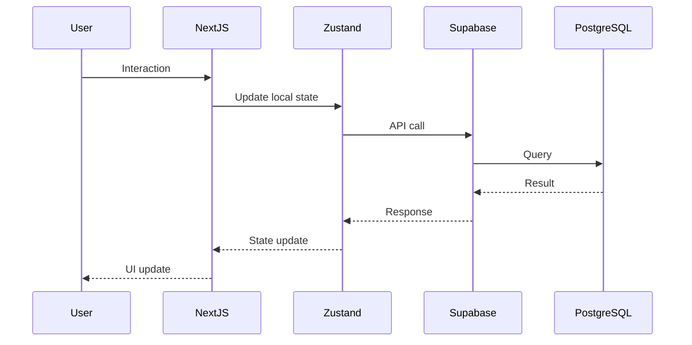
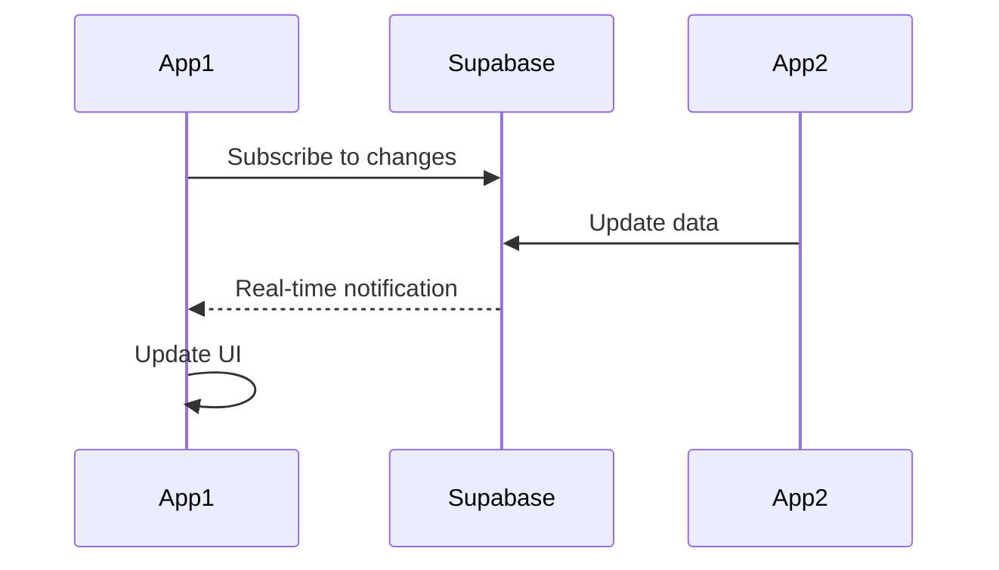

# System Design

<div class="reading-time">📖 10 min read</div>

A comprehensive overview of Zipli's architecture, design principles, and technical stack.

---

## Architecture Overview

<div class="architecture-diagram">
  
</div>

Zipli follows a modern **JAMstack architecture** with:

- **Frontend**: Next.js 14 (React 18)
- **Backend**: Supabase (PostgreSQL + Auth)
- **Deployment**: Vercel Edge Network
- **State Management**: Zustand
- **Real-time**: WebSocket subscriptions

---

## Core Principles

<div class="pattern-grid">
  <div class="pattern">
    <h4>🎯 Type Safety</h4>
    <p>100% TypeScript with strict mode</p>
    <code>strict: true</code>
  </div>
  
  <div class="pattern">
    <h4>⚡ Performance First</h4>
    <p>Sub-200ms response times</p>
    <code>&lt;200ms target</code>
  </div>
  
  <div class="pattern">
    <h4>📱 Mobile First</h4>
    <p>Responsive design patterns</p>
    <code>max-w-md default</code>
  </div>
  
  <div class="pattern">
    <h4>🔒 Security by Default</h4>
    <p>Row-level security, crypto tokens</p>
    <code>RLS enabled</code>
  </div>
</div>

---

## System Components

### 1. Frontend Layer

<div class="code-example">
  <div class="filename">Technology Stack</div>

```typescript
// Core Technologies
- Next.js 14 (App Router)
- React 18 (Server Components)
- TypeScript 5.4
- Tailwind CSS 3.4
- CVA (Class Variance Authority)

// State Management
- Zustand (Global state)
- React Hook Form (Forms)
- React Query (Coming soon)
```

</div>

**Key Features:**

- Server-side rendering for SEO
- Static generation for performance
- Dynamic imports for code splitting
- Optimistic UI updates

### 2. Backend Layer

<div class="code-example">
  <div class="filename">Supabase Services</div>

```sql
-- Core Services
PostgreSQL 15      -- Database
PostgREST         -- Auto-generated APIs
GoTrue            -- Authentication
Realtime          -- WebSocket subscriptions
Storage           -- File uploads
```

</div>

**Database Design:**

- 5 core tables (profiles, food_items, donations, requests, claims)
- Row-level security policies
- Composite indexes for performance
- Database triggers for automation

### 3. Infrastructure Layer

<div class="deployment-flow">
  <div class="flow-step">
    <span class="number">1</span>
    <h4>GitHub</h4>
    <p>Version control</p>
  </div>
  <div class="flow-arrow">→</div>
  <div class="flow-step">
    <span class="number">2</span>
    <h4>Vercel</h4>
    <p>CI/CD & hosting</p>
  </div>
  <div class="flow-arrow">→</div>
  <div class="flow-step">
    <span class="number">3</span>
    <h4>Edge Network</h4>
    <p>Global CDN</p>
  </div>
</div>

---

## Data Flow Architecture

### Request Lifecycle



### Real-time Updates



---

## Performance Optimizations

### Database Optimizations

<table class="performance-table">
  <thead>
    <tr>
      <th>Optimization</th>
      <th>Impact</th>
      <th>Implementation</th>
    </tr>
  </thead>
  <tbody>
    <tr>
      <td>Connection Pooling</td>
      <td>10x more connections</td>
      <td>PgBouncer enabled</td>
    </tr>
    <tr>
      <td>SQL JOINs</td>
      <td>90% fewer queries</td>
      <td>Single query with relations</td>
    </tr>
    <tr>
      <td>Composite Indexes</td>
      <td>30x faster queries</td>
      <td>Strategic index placement</td>
    </tr>
    <tr>
      <td>Query Caching</td>
      <td>50% less DB load</td>
      <td>Zustand persistence</td>
    </tr>
  </tbody>
</table>

### Frontend Optimizations

<div class="metrics">
  <div class="metric">
    <span class="value">95</span>
    <span class="label">Lighthouse Score</span>
  </div>
  <div class="metric">
    <span class="value">&lt;2s</span>
    <span class="label">Time to Interactive</span>
  </div>
  <div class="metric">
    <span class="value">60fps</span>
    <span class="label">Scroll Performance</span>
  </div>
  <div class="metric">
    <span class="value">50KB</span>
    <span class="label">Initial Bundle</span>
  </div>
</div>

---

## Security Architecture

### Authentication Flow

<div class="code-example">
  <div class="filename">Auth Implementation</div>

```typescript
// Multi-factor authentication support
1. Email/Password (primary)
2. Magic Links (passwordless)
3. OAuth (coming soon)
4. QR Code (terminals)

// Role-based access control
- food_donor: Can create donations
- food_receiver: Can claim donations
- city: Admin dashboard access
- terminal: Kiosk mode access
```

</div>

### Security Measures

<div class="checklist">
  ✓ Row-level security (RLS) on all tables<br/>
  ✓ Cryptographically secure tokens (crypto.randomUUID)<br/>
  ✓ Environment variable validation<br/>
  ✓ HTTPS-only in production<br/>
  ✓ Content Security Policy headers<br/>
  ✓ SQL injection prevention via parameterized queries<br/>
  ✓ XSS protection via React's built-in escaping<br/>
  ✓ CSRF protection via SameSite cookies
</div>

---

## Scalability Strategy

### Current Capacity

<div class="results-dashboard">
  <div class="result-card success">
    <h3>Users</h3>
    <div class="metric-large">500+</div>
    <p>Concurrent users</p>
  </div>
  
  <div class="result-card success">
    <h3>Requests</h3>
    <div class="metric-large">10K+</div>
    <p>Requests/minute</p>
  </div>
  
  <div class="result-card success">
    <h3>Database</h3>
    <div class="metric-large">8GB</div>
    <p>Storage capacity</p>
  </div>
  
  <div class="result-card success">
    <h3>Bandwidth</h3>
    <div class="metric-large">250GB</div>
    <p>Monthly transfer</p>
  </div>
</div>

### Scaling Roadmap

<details>
<summary><strong>Phase 1: Current (500 users)</strong></summary>

- Supabase Pro ($25/month)
- Vercel Pro ($20/month)
- Single region deployment
- Basic monitoring

</details>

<details>
<summary><strong>Phase 2: Growth (5,000 users)</strong></summary>

- Database read replicas
- Redis caching layer
- Multi-region deployment
- Advanced monitoring (DataDog)

</details>

<details>
<summary><strong>Phase 3: Scale (50,000 users)</strong></summary>

- Dedicated database cluster
- Global CDN (CloudFlare)
- Microservices architecture
- Kubernetes orchestration

</details>

---

## Monitoring & Observability

### Health Checks

<div class="code-example">
  <div class="filename">Health Endpoint</div>

```typescript
GET /api/health

{
  "status": "healthy",
  "checks": {
    "database": {
      "status": "healthy",
      "duration": 15
    },
    "auth": {
      "status": "healthy",
      "duration": 8
    }
  },
  "timestamp": "2024-08-21T10:00:00Z"
}
```

</div>

### Metrics Tracked

- **Performance**: Response times, query duration
- **Reliability**: Error rates, uptime
- **Usage**: Active users, API calls
- **Business**: Donations created, matches made

---

## Development Workflow

### Git Flow

```bash
main           # Production branch (protected)
├── develop    # Staging branch
└── feature/*  # Feature branches
```

### CI/CD Pipeline

<div class="test-steps">
  <div class="step">
    <span class="step-number">1</span>
    <div class="step-content">
      <h4>Pre-commit</h4>
      <code>Type check, lint, format</code>
    </div>
  </div>
  
  <div class="step">
    <span class="step-number">2</span>
    <div class="step-content">
      <h4>PR Checks</h4>
      <code>Tests, build, preview</code>
    </div>
  </div>
  
  <div class="step">
    <span class="step-number">3</span>
    <div class="step-content">
      <h4>Deploy</h4>
      <code>Automatic on merge</code>
    </div>
  </div>
</div>

---

## Technology Decisions

### Why These Technologies?

<table>
  <thead>
    <tr>
      <th>Technology</th>
      <th>Why Chosen</th>
      <th>Alternatives Considered</th>
    </tr>
  </thead>
  <tbody>
    <tr>
      <td><strong>Next.js</strong></td>
      <td>Full-stack framework, great DX</td>
      <td>Remix, SvelteKit</td>
    </tr>
    <tr>
      <td><strong>Supabase</strong></td>
      <td>Managed Postgres, real-time, auth</td>
      <td>Firebase, AWS RDS</td>
    </tr>
    <tr>
      <td><strong>Zustand</strong></td>
      <td>Simple, performant, TypeScript</td>
      <td>Redux, MobX</td>
    </tr>
    <tr>
      <td><strong>Tailwind</strong></td>
      <td>Utility-first, fast development</td>
      <td>CSS Modules, Emotion</td>
    </tr>
    <tr>
      <td><strong>Vercel</strong></td>
      <td>Next.js optimization, easy deploy</td>
      <td>Netlify, AWS</td>
    </tr>
  </tbody>
</table>

---

## Future Enhancements

<div class="next-steps-grid">
  <div class="next-card">
    <span class="icon">🤖</span>
    <h4>AI Integration</h4>
    <p>Smart donation matching</p>
  </div>
  
  <div class="next-card">
    <span class="icon">📍</span>
    <h4>Geolocation</h4>
    <p>Distance-based filtering</p>
  </div>
  
  <div class="next-card">
    <span class="icon">📊</span>
    <h4>Analytics</h4>
    <p>Advanced insights dashboard</p>
  </div>
</div>

---

## Related Documentation

- [Database Schema](./database-schema.md)
- [Component Architecture](./component-architecture.md)
- [Performance Optimizations](./performance-optimizations.md)
- [Security Best Practices](../03-development/security.md)

---

<div class="feedback">
  <h4>Questions about the architecture?</h4>
  <a href="https://github.com/your-org/zipli/discussions" class="button primary">
    Ask in Discussions →
  </a>
</div>
